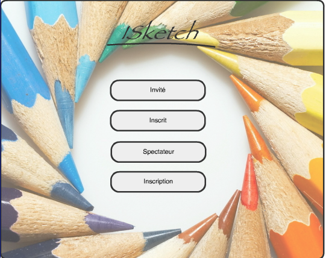

asSketch
========
projet de Client Serveur inspiré de `iSketch`, une version multijoueur de Pictionnary.

# Usage 

Le serveur est lanceable depuis la classe main `ASSketchServer`, les options associées sont consultables en
utilisant l'option `-h` depuis la ligne de commande ou en consultant la première partie du rapport dans lequel 
se trouve le Guide d'utilisation.

Pour lancer le client, il suffit d'ouvrir la page [Main.html](Client/Main.html) dans un navigateur web. :)

# Auteurs
Realisé par Adrien Becchis et Stéphane Ferreira, dans le cadre du cours
*Programmation Concurrente Réactive et Répartie* du Master STL, automne 2013

Le rapport associé est disponible dans le dossier `Notes`

*Précision*, le code est resté au même état depuis décembre 2013, à moins d'un engoument inattendu de cette version du jeu,
qui susciterai alors une surprise inestimable, celui-ci n'a pas vocation à évoluer, être amélioré, refactoré, et autres rimes en "é".

Néanmoins, il n'est pas impossible qu'un build.xml minimaliste voye le jour pour recréer un archive pour le serveur. :)